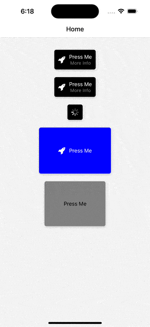

# React Native Customizable Button

[](https://www.npmjs.com/package/react-native-interactive-button)
[](https://www.npmjs.com/package/react-native-interactive-button)
[](https://coveralls.io/github/calintamas/react-native-interactive-button?branch=main)
[](https://github.com/prettier/prettier)

A flexible and feature-rich button component for React Native applications, offering a variety of customization options including icons, subtitles, loading state, and more.

<table style="width: 100%;">
  <tr>
    <td style="width: 50%; text-align: center;">
      <p style="font-weight: bold; height: 10%;">Android</p>
      
    </td>
    <td style="width: 50%; text-align: center;">
      <p style="font-weight: bold; height: 10%;">iOS</p>
      
    </td>
  </tr>
</table>


## Features

- **Customizable Styles**: Modify colors, sizes, padding, border radius, and more.
- **Loading State**: Show a loading spinner when the button is in a loading state.
- **Animation on Press**: Scale down animation on button press, enhancing user interaction.
- **Icon Support**: Include icons within your button, with options for left or right positioning.
- **Customizable Icon Color**: Change the color of icons as per your design needs.
- **Subtitle Option**: Add a subtitle for additional context or information.
- **Customizable Title and Subtitle Colors**: Set specific colors for title and subtitle text.
- **Shadow Effect**: Optional shadow for a more distinguished look.
- **Ripple Effect**: On Android, a ripple effect is provided for touch feedback.
- **Accessibility Features**: Improve accessibility with labels and hints.

## Installation

To add the Customizable Button to your React Native project, run:

```bash
npm install your-button-package-name
# or
yarn add your-button-package-name
```

## Usage

Import the `Button` component and use it in your project:

```javascript
import React from 'react';
import Button from 'your-button-package-name';
import Icon from 'react-native-vector-icons/FontAwesome'; // If using icons

const App = () => {
  return (
    <Button
      title="Press Me"
      subtitle="More Info"
      titleColor="black"
      subtitleColor="gray"
      onPress={() => console.log('Pressed')}
      style={{ backgroundColor: 'blue', borderColor: 'white' }}
      loading={false}
      disabled={false}
      iconName="rocket"
      iconComponent={Icon}
      iconColor="yellow"
      iconRight={false}
      shadow={true}
    />
  );
};

export default App;
```

## Props

- **title (string)**: Main text displayed on the button.
- **subtitle (string)**: Additional text displayed below the title.
- **titleColor (string)**: Color of the title text.
- **subtitleColor (string)**: Color of the subtitle text.
- **onPress (function)**: Function to execute on button press.
- **style (object)**: Custom styles to apply to the button.
- **loading (bool)**: If `true`, shows a loading spinner.
- **disabled (bool)**: If `true`, disables button interactions.
- **iconName (string)**: Name of the icon (if using icons).
- **iconComponent (elementType)**: The icon component (e.g., from `react-native-vector-icons`).
- **iconColor (string)**: Color of the icon.
- **shadow (bool)**: Enables shadow effect.
- **borderColor (string)**: Color of the button's border.
- **iconRight (bool)**: If `true`, places the icon to the right side.

## License

Licensed under the MIT License.
